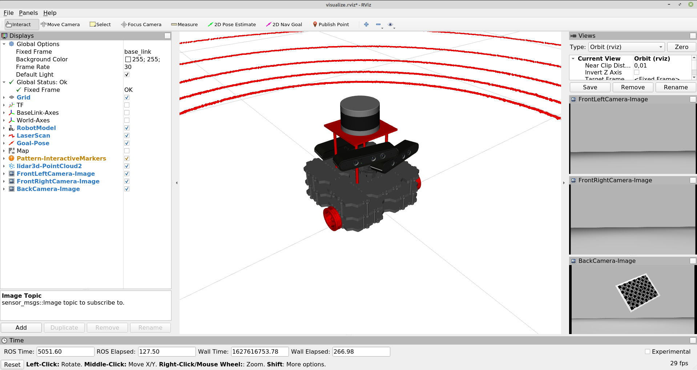

# SOFTBOT
**S**ensors to **O**dom **F**rame **T**est **B**ot (softbot) is a conceptual robot designed to test advanced calibration methodologies for mobile robotic platforms. The system contains the following sensors:

- **3dlidar** - A 3D LiDAR mounted on the robot frame;
- **rgbd_cameras** - Three RGB-D cameras mounted on the robot frame, two facing the front and one facing the back of the robot.



# How to run

First launch the gazebo simulation:

    roslaunch softbot_gazebo softbot.launch 

Then you can spawn the softbot robot:

    roslaunch softbot_bringup bringup.launch

You can record a bag file using:

    roslaunch softbot_bringup record.launch


# Installation

##### Add to .bashrc:
```
export ROS_BAGS="/home/<username>/bagfiles"
export ATOM_DATASETS="/home/<username>/datasets"
export GAZEBO_MODEL_PATH="`rospack find mmtbot_gazebo`/models:${GAZEBO_MODEL_PATH}"
```
